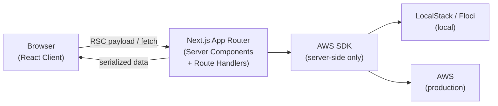
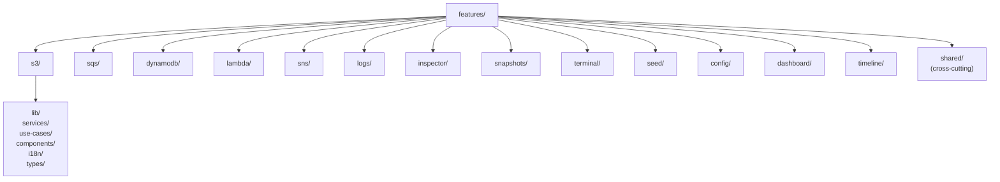

# Architecture

This document describes the high-level structure of the application. It covers the request flow, the feature-sliced directory layout, the AWS SDK boundary, i18n routing, and state management conventions.

No implementation code is included — this is a structural reference.

---

## Request flow



The browser never talks to AWS directly. All AWS SDK calls happen inside Server Components or Route Handlers. The browser receives serialized data (JSON, RSC payload).

---

## Feature-sliced structure

The codebase is organized around AWS service domains. Each domain lives under `features/` and follows a consistent internal layout:



### Layer responsibilities

| Layer | Purpose |
|-------|---------|
| `lib/` | AWS SDK client instantiation and low-level API wrappers (server-side only) |
| `services/` | Business logic that composes `lib/` calls |
| `use-cases/` | Application-level orchestration; called from Server Components or Route Handlers |
| `components/` | React components — Server Components by default, Client Components only when interactivity requires it |
| `i18n/` | Translation keys and locale-specific strings for this feature |
| `types/` | TypeScript types shared within the feature |
| `stores/` | Zustand stores for feature-local client UI state (present in some features) |

### Adding a new feature slice

When integrating a new AWS service, create `features/{service}/` and populate the layers you need. Not every layer is required — start with `lib/`, `use-cases/`, and `components/`. Add `services/` when business logic grows.

---

## AWS SDK boundary

The AWS SDK is **server-side only**. This is an architectural constraint, not a preference.

**Why**: The browser has no secure path to AWS credentials. Exposing credentials to the client is a security vulnerability. Even for local emulators with dummy credentials, the app follows the same rule to ensure the pattern is safe in any environment.

**Where**: SDK clients are initialized in `lib/aws/config.ts` (shared config) and `features/{service}/lib/` (per-feature clients). They are imported only in:
- Server Components (files without `"use client"`)
- Route Handlers (`app/api/**`)
- `use-cases/` and `services/` layers (which are called from the above)

Client Components receive serialized data passed down as props or fetched via Route Handlers.

---

## i18n routing

The app uses Next.js App Router's locale-based routing. All pages live under `app/[lang]/`:

```
app/
└── [lang]/
    ├── page.tsx          ← locale-aware home
    ├── s3/page.tsx
    ├── sqs/page.tsx
    └── ...
```

- Supported locales are defined in the shared i18n configuration.
- The `[lang]` segment is resolved at request time by the middleware.
- Fallback locale is `en` — requests without a locale prefix are redirected.
- Translation strings live in `features/{service}/i18n/` (feature-scoped) and `features/shared/i18n/` (global strings).

---

## State management

**Zustand** is used for client UI state. Two placement rules apply:

| Store location | Use for |
|---------------|---------|
| `features/shared/stores/` | UI state shared across features (e.g. mobile nav open/close, active profile) |
| `features/{service}/stores/` | Feature-local state (e.g. CloudWatch Logs polling state, Inspector buffer) |

Server state (data from AWS) is NOT stored in Zustand. It is fetched server-side and passed as props or streamed via RSC.

---

## Key patterns

- **RSC-first**: all components are Server Components by default. Add `"use client"` only when you need browser APIs, event handlers, or hooks.
- **Server Actions for mutations**: form submissions and write operations use Next.js Server Actions rather than client-side fetch calls.
- **Responsive design tokens**: Tailwind v4 theme tokens are defined in `app/globals.css` (`@theme inline`). Do not add custom breakpoint config files — extend the theme there.
- **Docker output**: the app builds as a Next.js standalone output, suitable for the published Docker image.

---

## Cross-cutting features

Some features are not AWS-service-specific but span the whole application:

| Feature | Purpose |
|---------|---------|
| `inspector` | Request/response inspector for AWS SDK calls; buffer managed server-side |
| `snapshots` | Save and restore AWS resource state |
| `terminal` | Embedded terminal for running CLI commands against the emulator |
| `seed` | Preset data seeding for LocalStack / Floci environments |
| `config` | Application configuration management |
| `timeline` | Event timeline across AWS services |
| `shared` | Common components, hooks, stores, utilities, and i18n strings |
